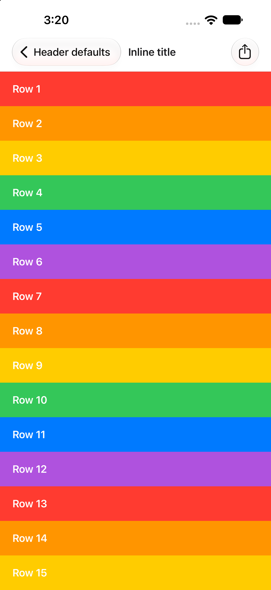
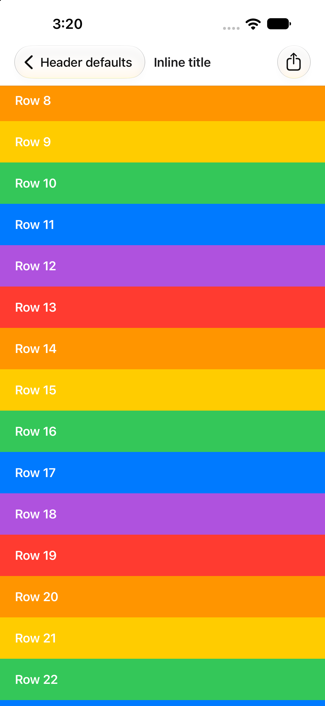
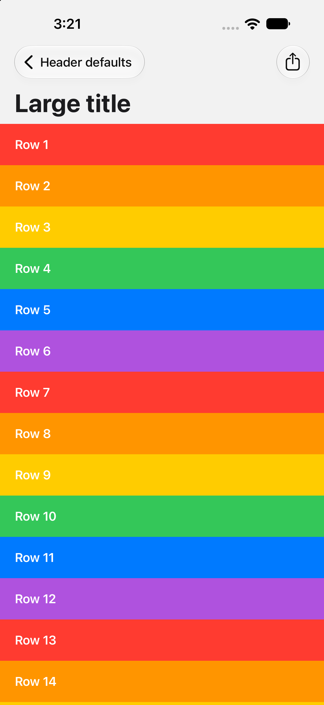
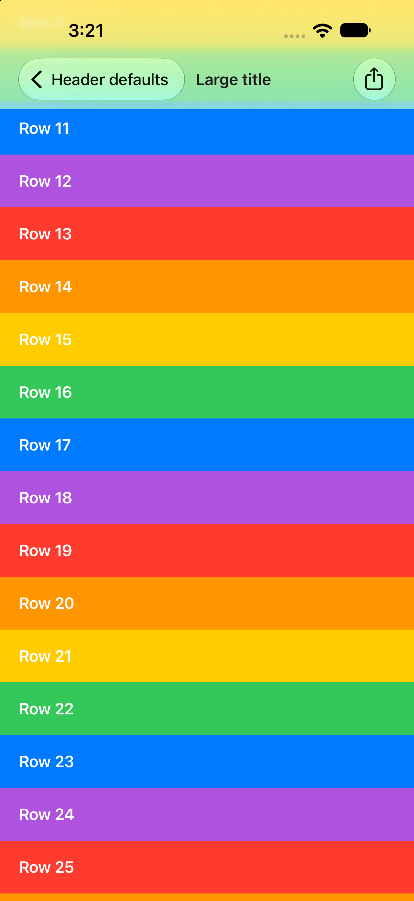

# expo-router header background repro

Minimal Expo SDK 58 app for an iOS native-stack header issue: with no header options, an **inline-title** screen gets an opaque bar with a hairline even at the scroll edge, so it never looks like a default iOS navigation bar (clear at the scroll edge).

Versions: `expo` 58.0.6, `expo-router` 58.0.16, `react-native-screens` 4.28.0, `react-native` 0.88.0-rc.3. Xcode 27, iPhone 18 Pro Max simulator, iOS 27.0.

No header background options are set anywhere (`app/_layout.tsx`).

## Run

```sh
bun install
npx expo run:ios
```

Tap **Inline title** or **Large title**. To screenshot without touch input, pass launch arguments:

```sh
xcrun simctl launch booted dev.brentvatne.headerrepro -screen inline -scrolled 0   # or 1, or -screen large
```

`-scrolled 1` scrolls the list 400 pt down after mount.

## Screenshots

| Inline, at rest | Inline, scrolled | Large, at rest | Large, scrolled |
|---|---|---|---|
|  |  |  |  |

- Inline: the bar is opaque white with a hairline in both states, and content never scrolls under it. A default `UINavigationController` bar is clear at the scroll edge.
- Large title: clear at rest; when scrolled the title collapses and content scrolls under the bar with the scroll edge effect. This one behaves as expected.

## Evidence for the react-native-screens fix

`pr-evidence/rns-scroll-edge/` holds before/after screenshots (top of the screen, iPhone 18 Pro Max, iOS 27.0) for a react-native-screens change that leaves `scrollEdgeAppearance` to UIKit when no background color is set. Two extra screens exercise it:

- **Inline, no background color** (`app/inline-system.tsx`): passes no `backgroundColor` to react-native-screens through `unstable_nativeProps.headerConfig`, since expo-router (like react-navigation) otherwise always passes `colors.card`.
- **Inline, explicit color** (`app/inline-color.tsx`): `headerStyle.backgroundColor` set, to check that explicit options keep their current behavior.

Open them with `-screen inline-system` or `-screen inline-color`.

## Evidence for the expo-router fix

`pr-evidence/expo-router-header-background/` holds before/after crops (top of the screen, iPhone 18 Pro Max, iOS 27.0) for an expo-router change that stops sending the default theme's `card` color as the iOS header background, combined with the react-native-screens change above. Screens: `inline` (no header options), `inline-color` (explicit `headerStyle.backgroundColor`) and `large`, each at rest and scrolled.


## Evidence for the expo-router change (themes and dark mode)

`pr-evidence/expo-router-header-background/v2/` has before/after crops for the expo-router change that stops sending the built-in theme's `card` color on iOS (after = that change plus the react-native-screens fix). Launch arguments used:

- `-theme default|dark` wraps the app in a `ThemeProvider` (without it, expo-router's default theme applies).
- The device appearance was switched with `xcrun simctl ui <udid> appearance dark|light`.
- `-screen inline-dark-content` opens an inline screen with `contentStyle: { backgroundColor: '#000' }` under the default theme.
